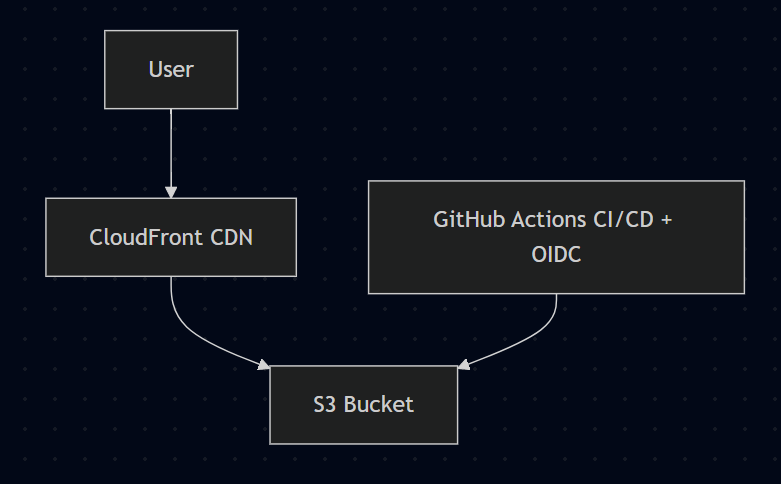

# 🏗️ System Architecture

## 📌 Overview

This application is a Single Page Application (SPA) built with Angular and deployed as a static website using AWS services, with an automated CI/CD pipeline powered by GitHub Actions.

The architecture is designed to be:

- Scalable  
- Secure  
- Low maintenance  
- Highly available  

---

## 🧩 Core Components

### Frontend
- **Angular**: SPA compiled into static assets (HTML, CSS, JavaScript)

### AWS Infrastructure
- **Amazon S3**:
  - Stores the static build artifacts
  - Configured as a private bucket

- **Amazon CloudFront**:
  - Content Delivery Network (CDN)
  - Handles HTTPS, caching, and global distribution
  - Configured with Origin Access Control (OAC) to securely access S3

### CI/CD
- **GitHub Actions**:
  - Automates build and deployment
  - Uses OIDC to securely authenticate with AWS (no static credentials required)

---

## 🔄 Deployment Flow

1. A push is made to the `main` branch  
2. GitHub Actions triggers the pipeline:
   - Installs dependencies  
   - Builds the Angular application  
3. The workflow assumes an AWS role using OIDC  
4. Build artifacts are uploaded to the S3 bucket  
5. CloudFront cache is invalidated  
6. The new version is distributed globally via CloudFront  

---

## 🌐 Request Flow

1. A user accesses the application URL  
2. The request is routed to CloudFront  
3. CloudFront fetches content from S3 (if not cached)  
4. S3 returns the static assets  
5. CloudFront delivers the content to the user  

---

## 🔐 Security

- The S3 bucket is **private**  
- Access to S3 is only allowed through CloudFront  
- CloudFront uses **Origin Access Control (OAC)** to authenticate requests  
- GitHub Actions uses **OIDC** to assume AWS roles securely without exposing credentials  

---

## ⚠️ Key Considerations

### SPA Routing (Angular)

Since Angular handles client-side routing:

- CloudFront is configured to redirect 403 and 404 errors to:
/index.html

This ensures routes like `/auth/login` or `/tours/all-tours` work correctly.

---

### Caching

- CloudFront caches static assets to improve performance  
- Cache invalidation is performed on each deployment  

---

### Known Issues and Solutions

#### 403 (AccessDenied) Error

**Cause:**  
CloudFront did not have permission to access the S3 bucket  

**Solution:**  
Properly configure Origin Access Control (OAC) and update the S3 bucket policy  

---

## 📊 Architecture Diagram (Simplified)

---

## 🚀 Future Improvements

- Add multiple environments (dev, staging, production)  
- Implement artifact versioning  
- Add monitoring and logging (e.g., CloudWatch)  
- Manage infrastructure as code (Terraform or AWS CDK)  

---

## 📎 Technologies Used

- Angular  
- AWS S3  
- AWS CloudFront  
- GitHub Actions  
- OpenID Connect (OIDC)  