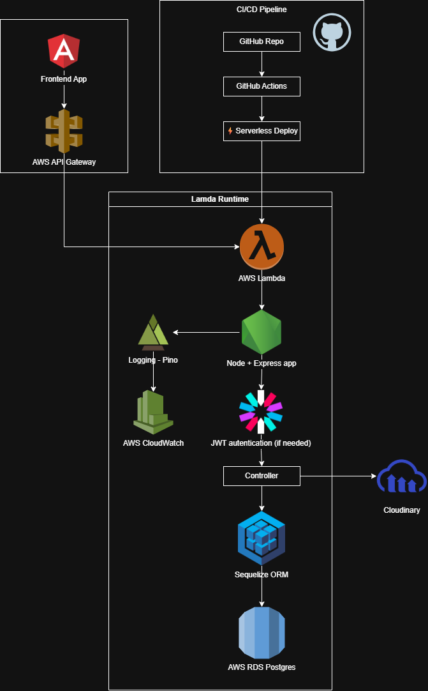

# 🏗️ Project Architecture

## 📌 Overview

This project implements a **serverless architecture** on AWS, where an Express-based API is deployed using AWS Lambda and the Serverless Framework. The system is designed to be scalable, decoupled, and fully automated through a CI/CD pipeline.

## 🧩 Core Components

### 1. Backend API

* Framework: Express
* Runtime: Node.js
* ORM: Sequelize

**Responsibilities:**

* Expose RESTful endpoints
* Handle business logic
* Manage authentication
* Interact with the database

---

### 2. Compute Layer

* Service: AWS Lambda

**Characteristics:**

* Event-driven execution
* Automatic scaling
* No server management required

The Express application is adapted to Lambda using:

* `serverless-http`

---

### 3. API Layer

* Service: Amazon API Gateway

**Responsibilities:**

* Expose public HTTP endpoints
* Route requests to Lambda
* Handle CORS and HTTP configurations

---

### 4. Logging & Observability

* Service: Amazon CloudWatch

**Features:**

* Centralized logging
* Error monitoring
* Log analysis via Logs Insights

Logging is implemented using:

* `pino`
* `pino-http`

---

### 5. Data Layer

* ORM: Sequelize
* Connection via environment variable:

  * `DATABASE_URL`

**Responsibilities:**

* Data modeling
* Query abstraction
* Connection management

---

### 6. Configuration Management

Environment variables are managed through:

* GitHub Actions (CI/CD pipeline)
* Serverless Framework (`serverless.yml`)

**Examples:**

* `DATABASE_URL`
* `TOKEN_SECRET`
* `CLOUDINARY_*`

---

### 7. CI/CD Pipeline

* Platform: GitHub Actions

**Deployment flow:**

1. Code is pushed to the `main` branch
2. Pipeline executes:

   * Install dependencies
   * Configure AWS credentials
   * Inject environment variables
3. Automatic deployment via:

   * `serverless deploy`

---

### 8. Frontend Applications

* Client applications consume the API via HTTP
* Connected to endpoints exposed through API Gateway

---

## 🔄 Request Flow

1. A client (frontend) sends an HTTP request
2. API Gateway receives the request
3. API Gateway invokes a Lambda function
4. Lambda executes the Express application
5. Express:

   * Runs middlewares (logging, authentication, etc.)
   * Processes business logic
   * Interacts with the database via Sequelize
6. A response is returned to the client
7. Logs are sent to CloudWatch

---

## ⚙️ Key Characteristics

* Serverless architecture (no server management)
* Automatic scaling
* CI/CD-enabled deployments
* Structured logging
* Clear separation of concerns

---

## 🚀 Advantages

* Cost-efficient (pay-per-use)
* High availability
* Easy deployment and rollback
* Native integration with AWS services

---

## ⚠️ Considerations

* Database connection handling in serverless environments
* Lambda cold starts
* Proper environment variable management
* Observability mainly based on logs (no full APM yet)

---

